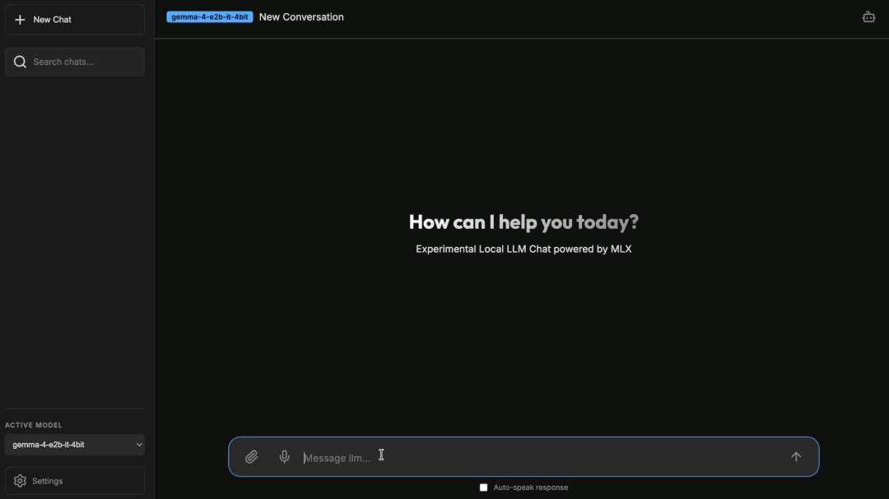
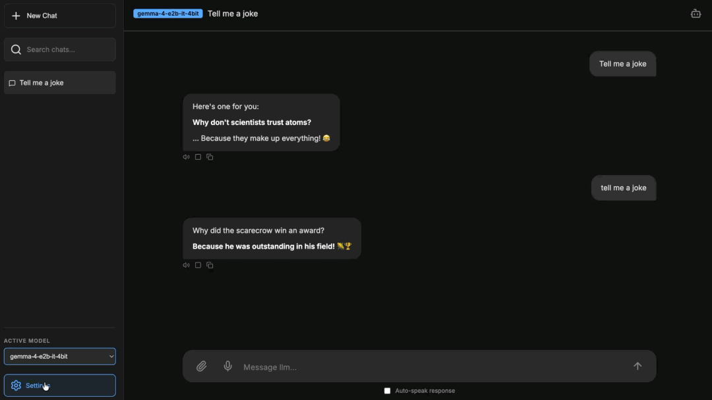
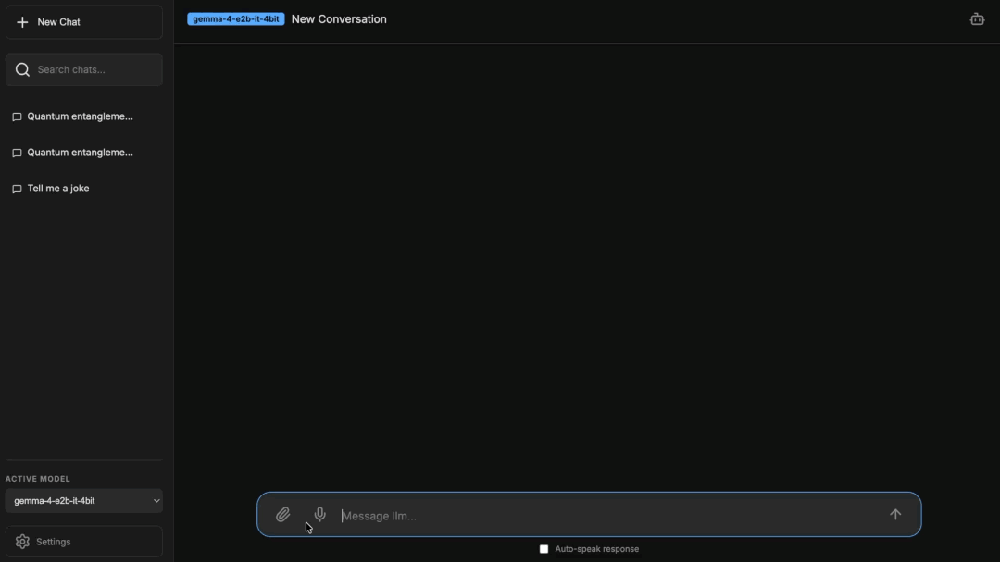
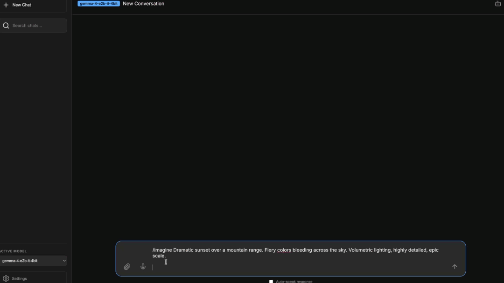

# LLM Local Chat 🤖

A premium, fast, and local LLM chat interface inspired by ChatGPT, heavily optimized for Apple Silicon using the **MLX** and **PyTorch MPS** frameworks.

Run massive open-source models completely offline while leveraging premium capabilities like Live Web Search, Document Retrieval (RAG), and Image Generation—all processed securely natively on your Mac.

## ✨ Feature Showcase

| **AI Chatting & Titles** | **Model Settings & Personas** |
|:---:|:---:|
|  |  |
| *Sleek dark-mode interface with dynamic, auto-refining chat titles and code highlighting.* | *Granular control over generation parameters and custom system personas.* |

### 📚 Advanced RAG Navigation

*Navigate massive PDFs with a batch slider or use **Similarity Search** to filter the document context for specific topics (e.g., searching "Paying Mortgage Early" in a financial guide).*

### 📸 Image Generation

*Generate high-fidelity images using FLUX.1 Schnell native on your Mac.*

---

## 🌟 Capabilities Matrix

This application transforms your machine into a fully private AI workstation:

### 🧠 Core Intelligence
- **Apple MLX Engine**: Experience lightning-fast text generation using quantized `mlx-community` LLMs without draining your battery.
- **Local & Private**: All inference, embedding, and chat history stay 100% locally on your machine.
- **Persistent Memory**: Chat histories are saved securely to a SQLite database and can be resumed at any time.
- **Dynamic Chat Titles**: Titles auto-refine after the first turn and every 3 turns. Uses a hybrid strategy: main model first (non-thinking) with title_worker fallback (1B Llama). Programmatic titles (`Doc: filename`, `Image: filename`, `Generated: prompt`) skip the LLM entirely for attachments and image commands.
- **Reusable System Prompts**: 24 built-in persona templates (Professors, Financial Analysts, Chefs, etc.) that can be searched, loaded, modified, and saved. Create your own templates and reuse them across chats.
- **Generation Stats**: Token count and tokens-per-second are displayed after every assistant response and persist across sessions.

### 🔍 Advanced Tooling
- **Live Web Search (`/web`)**: 
  - Start any message with `/web` (e.g., `/web What's the latest tech news?`). 
  - The backend intercepts the prompt, scrapes real-time DuckDuckGo results completely free of API bounds, and invisibly feeds them to your LLM for pinpoint accuracy.
- **Document Chat & RAG (Retrieval-Augmented Generation)**: 
  - Click the **Paperclip Icon** to upload `.txt` or `.pdf` files. 
  - An ultra-fast local pipeline chunks and indexes your documents. Subsequent messages inject the document in sequential page order, allowing you to browse through large PDFs naturally using the context slider.
- **📚 Large Document Navigation & Dual-Mode RAG**:
  - For documents longer than 50 chunks, the system uses a **sliding window** to prevent the model from becoming overwhelmed.
  - **Sequential Mode (Default)**: Browse the document in its actual page order. Ideal for broad summaries or reading through a file naturally.
  - **Similarity Search Mode**: Click the **Search Icon (🔍)** next to the slider to enter a specific topic (e.g., "financial risks"). The system will filter the entire document to show *only* the most relevant chunks in the slider.
  - **Context Slider**: An interactive UI slider in the chat header allows you to scrub through the batches of the document.
  - **Persistence**: Your reading position, search mode, and search topic are permanently saved to the database per-chat.
  - **Commands**: You can manually slide the UI bar to change the batch context, or type **`/next`** to advance the window forward.

### 📸 Vision & Image Generation
- **Text-To-Image Generation (`/imagine`)**: 
  - Start a prompt with `/imagine` (e.g., `/imagine A futuristic cyberpunk city`) to bypass the text LLM and natively boot **FLUX.1 Schnell** pipelines.
  - High fidelity 1024x1024 images are generated locally using Apple Silicon 4-bit `mflux` architecture, complete with dynamic ASCII progress bars seamlessly streaming directly into your chat window.
- **Image-To-Image Editing (`/edit`)**: 
  - Upload a source photo via the **Paperclip Icon** and enter a prompt starting with `/edit` (e.g., `/edit Change the background to a sunny beach in Hawaii`).
  - The framework intercepts the image as a structural baseline and creatively edits the canvas utilizing FLUX Matrix Noise.

> [!CAUTION]
> **Important FLUX.1 Authentication Step**: 
> The advanced image generation engine requires access to the `FLUX.1-schnell` repository owned by Black Forest Labs. Because this repository is **gated**, your server will crash with a `401 Unauthorized` HTTP error unless you authenticate.
> 1. Log into your Hugging Face account, navigate to [FLUX.1-schnell](https://huggingface.co/black-forest-labs/FLUX.1-schnell), and **explicitly click the "Agree to access repository" button** on their model card. (Generating a token is not enough; your account must independently accept their terms).
> 2. Create a Hugging Face Token:
>     - Go to your Hugging Face Access Tokens Settings.
>     - Click the **New token** button.
>     - Configure the token details:
>       - **Token name**: Give it a memorable name (e.g., Local-LLM-App).
>       - **Token type**: Set this to **Read** (a Read token is all that is required to download gated models).
>     - Click **Generate**.
>     - Click the **Copy** icon next to your newly created token (it will start with `hf_...`).
> 3. Add your token in the app: open **Settings → 🔑 HuggingFace Token**, paste your token (`hf_...`), and click **Save**. The token is verified and stored securely in your **macOS Keychain** (never in plaintext). Using `/imagine` or `/edit` without a token shows a reminder.

- **Vision Models (`mlx_vlm`)**: 
  - Hook into multimodal functionality natively! Pass photos seamlessly into Vision LLMs locally (e.g., `Gemma-4`).

### 🎙️ Audio Interaction
- **Speech-to-Text**: Click the mic icon to dictate physical voice sequences to the LLM.
- **Text-to-Speech**: AI responses can be spoken aloud intelligently using the integrated macOS `say` command daemon. To download premium voices on macOS, open System Settings search for System Voice and click on it. Goto the System Voice dropdown menu to select Manage Voices..., click the download cloud icon next to your preferred "Premium" voice eg: Siri (Voice 4), and then re-select it from the main dropdown menu to set it as your default.

### 📐 Professional Math Rendering
- **KaTeX Support**: Integrated professional LaTeX mathematical typesetting. The system automatically detects and renders complex inline and block-level math formulas (e.g., `$E=mc^2$`) with high-fidelity, offline-first KaTeX libraries.

### 🧠 Advanced Memory & Self-Healing
- **Dual-Layer Memory System**: 
  - **Rolling Window**: Verbatim, short-term memory (default ~4000 tokens) that keeps your immediate conversation perfectly coherent and lightning-fast.
  - **Progressive Summarization**: As messages "fall out" of the rolling window, the LLM automatically condenses them into a long-term "Progressive Summary" that persists indefinitely, ensuring the AI never forgets the core facts of a 100+ message thread.
- **Crash Recovery (Self-Healing)**: 
  - If the server crashes (e.g., due to an OOM on a massive model), it will automatically detect the crash on next boot and reset the active model to the lightweight `gemma-4-e2b` safe default. No more getting stuck in a crash loop!
      - **Live OOM Protection**: Models run in a separate child process. If a model runs out of memory mid-generation, only the worker crashes — the server stays alive, auto-recovers with the fallback model, and shows a detailed error toast with the exact crash cause (e.g. Metal Insufficient Memory).

---

## 🚀 Getting Started

### 1. Requirements

- A Mac with Apple Silicon (M-series chips).
- Python 3.14+ (or compatible environment).

### 2. Native macOS Application (Recommended for All Users) 🍎

For the most premium and seamless experience, use the pre-built macOS application. This provides a dedicated window for your AI and handles all server management for you.

1.  **Clone & Navigate**: Open your terminal and clone the repository:
    ```bash
    git clone https://github.com/ronaldrosejoseph/local_llm.git
    cd local_llm
    ```
2.  **Build**: Run **`./make_app.sh`** to build the application. This will create **`Local LLM.app`** in the project folder.
3.  **Launch**: Double-click **`Local LLM.app`**. (You can move this to your `/Applications` folder for easy access).
4.  **Startup**: A loading spinner will appear while the backend server boots up.
> [!IMPORTANT]
> **First Boot**: The very first launch will take **several minutes** as it automatically downloads the required Python environment and the baseline LLM model.
5.  **Shutdown**: Closing the app window (or Cmd+Q) will automatically shut down the LLM server and free up your Mac's memory.

---

### 3. Fast Setup (Terminal Only)

If you prefer using the terminal, you can boot the server manually. This will automatically detect your environment, install or compile dependencies, and launch the server:

```bash
chmod +x start.sh stop.sh restart.sh
./start.sh
```

> [!IMPORTANT]
> **First Boot**: The initial run will take **several minutes** to download the Python environment and baseline models.

*(Note: The very first time you execute an image generation command, the `mflux` library will forcibly intercept your command to download the FLUX.1 baseline models locally, which consumes roughly **~24GB** of space inside `~/.cache/`. Do not interrupt this process.)*

### 4. Server Management

Control your FastAPI application running in the background natively:

```bash
# Boot server locally
./start.sh

# Complete graceful shutdown (Deletes lifecycle lock to avoid recovery logic)
./stop.sh

# Flush and restart (Useful when changing underlying backend code)
./restart.sh

# Uninstall: stop server, optionally delete HF model cache, remove project
./uninstall.sh
```

**Access the Chat**: Open your browser and navigate to [http://localhost:8000](http://localhost:8000).

---

## 🛠️ Architecture

- **Backend**: FastAPI, MLX (`mlx_lm`, `mlx_vlm`, `mflux`), PyTorch, Sentence-Transformers
- **Frontend**: Vanilla HTML/CSS/JS, DOMPurify (XSS Protection), Lucide Icons, KaTeX
- **Storage**: SQLite natively tracking chat IDs, messages, and model registries.
- **Memory Architecture**: Dual-Layer (Rolling Window + Progressive Summarization)
- **Default Baseline Architecture**: `mlx-community/gemma-4-e2b-it-4bit`

---

## 🧩 Modding & Available Models

The application dynamically detects model environments. You can add new ones by pasting their Hugging Face identifier into the custom UI settings modal: [MLX LLM Collections](https://huggingface.co/models?sort=trending&search=mlx)

- **Gemma 4 2B (Default)**: `mlx-community/gemma-4-e2b-it-4bit`
- **Gemma 4 4B**: `mlx-community/gemma-4-e4b-it-4bit`
